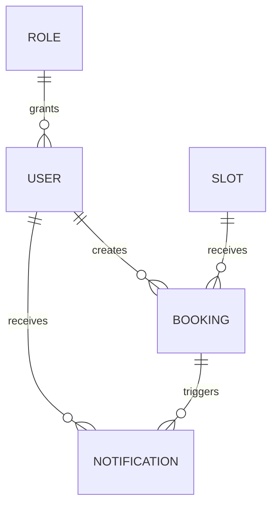

# spec.md — Mini Booking System: auth-lite + слой данных

## 1. Краткое описание

Учебный сервис онлайн-записи на слоты. Документ описывает два модуля:

- **auth-lite** (реализован на предыдущем уроке, статус — готово): регистрация, вход по email/паролю, серверная сессия, минимальный контроль доступа по ролям (`user`, `admin`, `super_admin`). Архивная версия этой части спеки — `docs/archive/spec.auth-lite.md`.
- **Слой данных** (текущий шаг): контракт данных и серверные правила для слотов, броней и внутренних уведомлений — `users`, `roles`, `slots`, `bookings`, `notifications`. Этот раздел задаёт, какие данные должны существовать, как они связаны и какие правила нельзя нарушать на сервере. Реализация (модели Prisma, миграции, Server Actions, UI) — предмет последующих шагов `Plan.md`, не этого документа.

## 2. Цели

**auth-lite (готово):**
- Публичная регистрация создаёт аккаунт с ролью `user`.
- Вход по email/паролю устанавливает серверную сессию.
- Пароль хранится только как хеш (bcryptjs, 12 раундов), исходное значение нигде не сохраняется и не логируется.
- Страница аккаунта доступна только авторизованному владельцу и показывает его роль и профиль.
- Ролевые проверки доступа выполняются на сервере — а не только скрытием элементов интерфейса.
- Ровно один `super_admin` существует изначально, создаётся seed-скриптом; публичная регистрация не может создать `super_admin` или `admin`.

**Слой данных (текущий шаг):**
- Зафиксировать сущности `users`, `roles`, `slots`, `bookings`, `notifications` и связи между ними как контракт для последующей реализации.
- Зафиксировать статусы брони (`pending`/`confirmed`/`cancelled`) и допустимые переходы между ними.
- Зафиксировать матрицу ролей для действий со слотами, бронями и уведомлениями (кто может создать/подтвердить/отменить бронь, кто управляет слотами).
- Зафиксировать серверные проверки, обязательные при реализации: доступ по роли, запрет администрирования чужих броней для `user`, запрет действий вне матрицы ролей для `admin`, запрет брони на недоступный слот, запрет некорректных переходов статуса, обязательное сохранение уведомления владельцу брони.

## 3. Не-цели

**Общее (обе фазы):**
- OAuth/социальные провайдеры, восстановление пароля, email-подтверждение — не входят в scope.
- Middleware-based route protection и сторонние auth-библиотеки (NextAuth.js/Auth.js) — сознательно не используются (см. раздел 7).
- Разграничение прав `admin` vs `super_admin` сверх факта их различия как ролей — не реализуется (роли функционально идентичны для всех действий этого документа, включая действия со слотами/бронями).

**Слой данных (текущий шаг, документация контракта):**
- Реализация Prisma-моделей, миграций, Server Actions и UI для слотов/броней/уведомлений — вне этого документа; выполняется в последующих шагах `Plan.md` на основе зафиксированного здесь контракта.
- Мульти-местные слоты (`capacity > 1`) — не рассматриваются; один слот в любой момент времени занят не более чем одной активной (`pending`/`confirmed`) бронью.
- Изменение слота у уже созданной брони (перенос брони на другой слот) — не рассматривается; единственные переходы — смена статуса.
- Статус прочтения уведомления (read/unread) — не рассматривается на этом шаге; зафиксированы только факт создания уведомления и его отображение в списке личного кабинета.
- Уведомление администраторам о новой заявке (`pending`) — не рассматривается; правило раздела 6 фиксирует уведомление только владельцу брони.
- Отдельная таблица `Role` — не вводится; роль остаётся enum-полем на `User`, как в auth-lite (см. раздел 5).

## 4. Пользователи и сценарии

| Роль | Что можно (auth-lite) | Что можно (слой данных) |
|---|---|---|
| `guest` | Открыть формы регистрации и входа, создать учётную запись, войти | Ничего — доступ к слотам/бронированиям только после входа |
| `user` | Войти в свой аккаунт, видеть первый контур будущих записей и уведомлений | Создать бронь (`pending`) на доступный слот для себя; отменить свою бронь в статусе `pending`; видеть только свои брони и свои уведомления |
| `admin` | Участвовать в матрице ролей и серверных проверках | Управлять слотами (создание/редактирование); подтверждать (`pending → confirmed`) и отменять (`→ cancelled`) любую бронь; видеть все брони |
| `super_admin` | Существовать как начальная административная точка через seed | Функционально идентичен `admin` для всех действий этого документа |

**Происхождение ролей:** `guest` — любой неавторизованный посетитель; `user` — создаётся публичной регистрацией; `admin` — назначается вне публичной регистрации (вручную/seed); `super_admin` — создаётся только seed-скриптом.

**Матрица действий (слой данных):**

| Действие | guest | user | admin / super_admin |
|---|---|---|---|
| Создать бронь (`pending`) для себя | ❌ | ✅ (только для себя) | ❌ (роль администрирует, а не бронирует) |
| Отменить свою бронь в статусе `pending` | ❌ | ✅ (только свою) | — |
| Отменить чужую бронь в статусе `pending` | ❌ | ❌ | ✅ |
| Подтвердить бронь (`pending → confirmed`) | ❌ | ❌ | ✅ |
| Отменить бронь в статусе `confirmed` | ❌ | ❌ | ✅ |
| Создавать/редактировать слоты | ❌ | ❌ | ✅ |
| Видеть список своих броней и уведомлений | ❌ | ✅ (только свои) | ✅ (свои — как у любого пользователя аккаунта) |
| Видеть все брони | ❌ | ❌ | ✅ |

## 5. Сущности и контракт данных

**Минимальная логика:**
- `users` — пользователи, которые входят в систему, создают брони или администрируют их (уже реализовано в auth-lite как модель `User`).
- `roles` — роли, определяющие доступ к действиям. **Решение:** остаются enum-полем `role` на `User` (`user`/`admin`/`super_admin`), как в auth-lite — отдельная таблица `Role` не вводится (см. раздел 3). Логически на ER-схеме роль показана как отдельная сущность, физически это одно enum-поле.
- `slots` — доступные интервалы записи.
- `bookings` — записи пользователей на слоты.
- `notifications` — внутренние уведомления в личном кабинете пользователя.

**Связи:**

Пользователь связан с ролью (enum-поле, не отдельная таблица — см. выше), бронь — с пользователем и слотом, уведомление — с пользователем и событием бронирования.

**Поля сущностей (контракт для следующей реализации):**

| Сущность | Поля | Примечание |
|---|---|---|
| `User` | `id`, `name`, `email` (уникальный), `passwordHash`, `role` (`user`/`admin`/`super_admin`), `createdAt` | Уже реализовано в auth-lite, без изменений |
| `Slot` | `id`, `startTime`, `endTime`, `createdAt` | Доступность слота не хранится отдельным полем — вычисляется как отсутствие активной (`pending`/`confirmed`) брони на этот слот |
| `Booking` | `id`, `slotId` → `Slot`, `userId` → `User`, `status` (`pending`/`confirmed`/`cancelled`), `createdAt`, `updatedAt` | Ровно один слот на одну бронь; `updatedAt` фиксирует момент последнего перехода статуса |
| `Notification` | `id`, `userId` → `User`, `bookingId` → `Booking`, `message`, `createdAt` | Создаётся при создании брони и при каждой смене статуса (см. раздел 6 «Серверные проверки») |

## 6. Статусы брони и серверные проверки

**Статусы:**

| Статус | Что означает | Что проверять на сервере |
|---|---|---|
| `pending` | Пользователь запросил бронь, администратор ещё не подтвердил её | Слот существует, доступен и не занят другой активной бронью |
| `confirmed` | Администратор подтвердил бронь | Действие выполняет роль с нужными правами (`admin`/`super_admin`), текущий статус брони — `pending` (переход допустим только из `pending`) |
| `cancelled` | Бронь отменена | Повторная отмена, подтверждение уже отменённой брони и действия сторонних пользователей отклоняются; терминальный статус — из `cancelled` переходов нет |

**Допустимые переходы:** `pending → confirmed`, `pending → cancelled`, `confirmed → cancelled`. Недопустимо: `confirmed → pending`, любой переход из `cancelled`, повторный переход в тот же статус.

**Серверные проверки (обязательны при реализации):**
1. Доступ к действиям зависит от роли (см. матрицу в разделе 4).
2. Пользователь не может администрировать чужие брони — `user` действует только над бронями, где `booking.userId === текущий пользователь`.
3. Администратор не может выполнить действие, не разрешённое матрицей ролей (например, `admin` не создаёт брони от своего лица как клиент — см. раздел 4).
4. Нельзя создать бронь на недоступный слот — слот должен существовать и не иметь другой активной (`pending`/`confirmed`) брони.
5. Нельзя выполнить некорректный переход статуса — только переходы, перечисленные выше как допустимые.
6. Уведомление должно сохраняться для того пользователя, чья бронь создана или изменила статус (владелец брони — `booking.userId`, не инициатор действия).

## 7. Нефункциональные требования

- Пароль хешируется bcryptjs с 12 раундами; открытый пароль не логируется и не хранится нигде, кроме момента обработки запроса.
- Session-токен непредсказуем (криптографически случайный), хранится в cookie; серверная запись в таблице `Session` — источник истины о валидности.
- Все проверки доступа (ролевые, по сессии, по владению бронью, по статусу) выполняются в Node runtime на сервере, с прямым доступом к Prisma/PostgreSQL — без промежуточного Edge-слоя с неполной проверкой.
- Prisma и `@prisma/client` зафиксированы точной версией `6.19.3` (`--save-exact`).
- Проверка доступности слота и допустимости перехода статуса выполняется атомарно на сервере в момент действия — не полагаться на состояние, полученное клиентом ранее.

## 8. Технический подход

**Выбран вариант C: Server Actions для мутаций + общий serverside helper (`lib/auth.ts`), без middleware.** (Решение принято в auth-lite, распространяется на слой данных.)

- Регистрация, вход, выход, а также будущие действия со слотами/бронями реализуются как Server Actions (`"use server"`).
- `getCurrentUser()` и `requireRole(role)` — переиспользуемые функции в `lib/auth.ts`; для слоя данных к ним добавляется владельческая проверка (`booking.userId === currentUser.id`) в местах, где `user` действует над собственной бронью.
- Middleware (`middleware.ts`) не используется — по тем же причинам, что и в auth-lite (Edge runtime не даёт полноценного доступа к Prisma).
- Сторонние auth-библиотеки не используются.
- Роль остаётся enum-полем `User.role` (см. раздел 5) — не вводится отдельная таблица `Role`, чтобы не расширять миграцию сверх необходимого для этого шага и не дублировать источник истины о правах.

## 9. Этапы реализации

**auth-lite (готово, предыдущий урок):**
1. Prisma-модели `User` и `Session`.
2. `lib/auth.ts`: хеширование/проверка пароля, `getCurrentUser()`, `requireRole()`.
3. Server Actions: `register`, `login`, `logout`.
4. Страницы регистрации, входа, защищённая `/account`.
5. Seed-скрипт с одним `super_admin`.
6. Навигация со всеми пунктами меню без скрытия по роли.

**Слой данных (текущий шаг — контракт зафиксирован этим документом; порядок реализации детализируется в `Plan.md`):**
1. Prisma-модели `Slot`, `Booking`, `Notification` + миграция (без отдельной таблицы `Role`, см. раздел 5).
2. Серверные проверки статусных переходов и владения бронью в `lib/auth.ts`/новом helper-модуле.
3. Server Actions создания/подтверждения/отмены брони с проверками из раздела 6.
4. Создание `Notification` при создании брони и при каждой смене статуса.
5. UI для слотов/броней/уведомлений — вне scope этого документа, отдельный шаг.

## 10. Критерии успеха

**auth-lite (готово):**
- Публичная регистрация создаёт пользователя строго с ролью `user`, даже если в запросе передано другое значение `role`.
- Вход выдаёт рабочую серверную сессию (запись в `Session` + cookie), выход её инвалидирует.
- `/account` недоступна без авторизации и показывает данные только владельца сессии.
- Обращение к административному разделу без роли `admin`/`super_admin` блокируется на сервере независимо от того, виден ли пункт меню.
- После запуска seed в БД существует ровно один `super_admin`; повторный запуск seed не создаёт второго.
- Prisma и `@prisma/client` зафиксированы версией `6.19.3` без диапазонов.

**Слой данных (контракт для следующей реализации, проверяется после кода):**
- Каждая из сущностей `Slot`, `Booking`, `Notification` реализована с полями и связями, зафиксированными в разделе 5.
- Все три статуса брони и три допустимых перехода из раздела 6 покрыты серверными проверками; недопустимые переходы отклоняются.
- Бронь нельзя создать на слот, у которого уже есть активная (`pending`/`confirmed`) бронь.
- `user` не может изменить статус чужой брони ни при каком запросе; проверка выполняется на сервере, а не только в UI.
- `admin`/`super_admin` не может выполнить действие вне матрицы ролей раздела 4 (например, создать бронь от своего лица как клиент).
- При создании брони и при каждой смене статуса создаётся ровно одна запись `Notification` для владельца брони.

## 11. Риски и компромиссы

**auth-lite:**
- Отсутствие middleware упрощает архитектуру, но требует не забыть явно вызвать `requireRole()`/`getCurrentUser()` на каждой новой защищённой странице.
- Показ всех пунктов навигации всем ролям — осознанный компромисс в пользу простоты; безопасен только при наличии надёжных серверных проверок.

**Слой данных:**
- Проверка «слот не занят другой активной бронью» и создание брони должны выполняться как единая атомарная операция на сервере — при конкурентных запросах на один слот без этого возможна гонка (два `pending` на один слот). Требование атомарности зафиксировано в разделе 7, конкретный механизм (транзакция/уникальный констрейнт) — решение уровня реализации, не этого документа.
- Отсутствие read/unread у уведомлений (раздел 3) — осознанный компромисс на этом шаге; при добавлении такого статуса потребуется отдельная миграция `Notification`.
- Функциональная идентичность `admin` и `super_admin` распространена на слой данных без дополнительного пересмотра — при будущем разграничении прав матрица раздела 4 потребует пересмотра для обеих ролей отдельно.

## 12. Открытые вопросы

- Нужно ли в будущем уведомлять `admin`/`super_admin` о новых заявках (`pending`)? На этом шаге правило раздела 6 ограничено уведомлением владельца брони — решение отложено.
- Нужен ли статус прочтения уведомления (read/unread) на следующих шагах — отложено (раздел 3).
- Разграничение прав `admin` и `super_admin` — по-прежнему отложено на будущий шаг, распространяется и на действия со слотами/бронями.
- Нужно ли в будущем скрывать пункты навигации по роли, или окончательно остаться при подходе «показывать всё, проверять на сервере» — решение отложено как отдельная UX-задача (наследуется из auth-lite).
